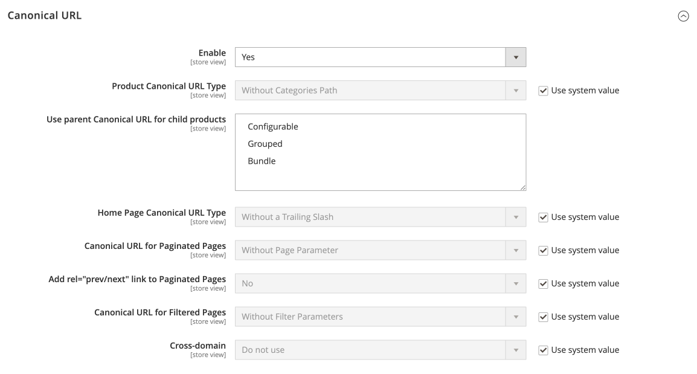
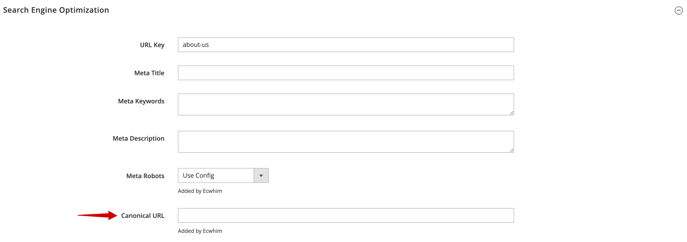

# Canonical URL

## Configuration

Stores > Configuration > ECWHIM SEO > General > Canonical URL

{ loading=lazy }

Set **Enable** to `Yes` to see more settings.

{ loading=lazy }

| FIELD                                       | DESCRIPTION |
| ------------------------------------------- | ----------- |
| Enable                                      | Determines if the canonical URL functionality is enabled. Options: Yes / No |
| Product Canonical URL Type                  | Determines which product URL will be used as the canonical URL. If your catalog is configured to include the category path in product URLs, your store will generate multiple URLs that point to the same product page: <br> 1. https://example.com/product.html <br> 2. https://example.com/category/product.html <br> 3. https://example.com/category/subcategory/product.html <br> Options: <br> **Without Categories Path** - Uses the product URL without the category path. (1) <br> **Min nesting of Categories** - Uses the product URL with minimal category nesting. (2) <br> **Max nesting of Categories** - Uses the product URL with maximum category nesting. (3) |
| Use parent Canonical URL for child products | Determines the product types whose child products will have the same canonical URL as the canonical URL of the parent product. Options: Configurable / Grouped / Bundle |
| Home Page Canonical URL Type                | Determines whether the home page canonical URL should contain a trailing slash. Options: Without a Trailing Slash / With a Trailing Slash |
| Canonical URL for Paginated Pages           | Determines whether the canonical URL of paginated pages should contain a pagination parameter (`?p=n`). Options: Without Page Parameter / With Page Parameter |
| Add rel="prev/next" link to Paginated Pages | Determines whether to include a rel="prev/next" link in the `<head>` section of paginated pages. Options: Yes / No |
| Canonical URL for Filtered Pages            | Determines whether the canonical URL of filtered pages should contain a filter parameters or it should not be used at all on this type of page. Options: Without Filter Parameters / With Filter Parameters / Do not add |
| Cross-domain                                | If there are multiple stores with the same or very similar content, this option helps set up a cross-domain canonical URL to avoid duplicate content. |
| Cross-domain URL	                          | The base URL of the store that is outside of the current Magento 2 installation. |

## Individual settings for entities

### Product

Open the product in edit mode and expand the _Search Engine Optimization_ section.

{ loading=lazy }

| FIELD         | DESCRIPTION |
| ------------- | ----------- |
| Canonical URL | The URL that is used as the canonical URL for this product. For example: <br> _https://cross-domain.com/product.html_ <br> Set a relative URL to use the URL of another product or entity within the current store view. For example: <br> _other-product.html_ |

### Category

Open the category in edit mode and expand the _Search Engine Optimization_ section.

{ loading=lazy }

| FIELD         | DESCRIPTION |
| ------------- | ----------- |
| Canonical URL | The URL that is used as the canonical URL for this category. For example: <br> _https://cross-domain.com/category.html_ <br> Set a relative URL to use the URL of another category or entity within the current store view. For example: <br> _other-category.html_ |

### CMS Page

Open the CMS page in edit mode and expand the _Search Engine Optimization_ section.

{ loading=lazy }

| FIELD         | DESCRIPTION |
| ------------- | ----------- |
| Canonical URL | The URL that is used as the canonical URL for this CMS page. For example: <br> _https://cross-domain.com/cms-page-url-key_ <br> Set a relative URL to use the URL of another CMS page or entity within the current store view. For example: <br> _url-key-of-another-cms-page_ |

## GraphQL

The free [Canonical URL GraphQl](https://github.com/ecwhim/magento2-canonical-url-graph-ql) module provides support of Magento GraphQL for Canonical URL functionality.

### CategoryInterface attribute

The following table defines the CategoryInterface attribute added by our extension.

| ATTRIBUTE         | DATA TYPE | DESCRIPTION |
| ----------------- | --------- | ----------- |
| ecw_canonical_url | String    | The absolute canonical URL. |

#### Example Usage

The following query shows how to get the canonical URL for a category:

**Request:**
```graphql
{
    categoryList(filters: {ids: {eq: "14"}}){
        id
        name
        ecw_canonical_url
    }
}
```

**Response:**
```json
{
    "data": {
        "categoryList": [
            {
                "id": 14,
                "name": "Jackets",
                "ecw_canonical_url": "https://example.com/men/tops-men/jackets-men.html"
            }
        ]
    }
}
```

### CmsPage attribute

The following table defines the CmsPage attribute added by our extension.

| ATTRIBUTE         | DATA TYPE | DESCRIPTION |
| ----------------- | --------- | ----------- |
| ecw_canonical_url | String    | The absolute canonical URL. |

#### Example Usage

The following query shows how to get the canonical URL for a CMS page:

**Request:**
```graphql
{
    cmsPage(identifier: "customer-service") {
        identifier
        title
        ecw_canonical_url
    }
}
```

**Response:**
```json
{
    "data": {
        "cmsPage": {
            "identifier": "customer-service",
            "title": "Customer Service",
            "ecw_canonical_url": "https://example.com/customer-service"
        }
    }
}
```

### ProductInterface attribute

The following table defines the ProductInterface attribute added by our extension.

| ATTRIBUTE         | DATA TYPE | DESCRIPTION |
| ----------------- | --------- | ----------- |
| ecw_canonical_url | String    | The absolute canonical URL. |

#### Example Usage

The following query shows how to get the canonical URL for a product:

**Request:**
```graphql
{
    products(filter: { sku: { eq: "24-MB01" } }) {
        items {
            name
            sku
            ecw_canonical_url
        }
    }
}
```

**Response:**
```json
{
    "data": {
        "products": {
            "items": [
                {
                    "name": "Joust Duffle Bag",
                    "sku": "24-MB01",
                    "ecw_canonical_url": "https://example.com/joust-duffle-bag.html"
                }
            ]
        }
    }
}
```
