# Gift Card

## Introduction

The [Gift Card Extension for Magento 2](https://www.ecwhim.com/magento-2-gift-card-extension.html) provides all the necessary functionality for working with gift cards. Gift cards can be created both by the site administrator and automatically when purchasing a special type of product (Gift Card). There are two types of gift cards: Virtual (sent to the recipient via email) and Physical. One or multiple gift cards can be used to pay for the entire order or a portion of it.

## Manage gift cards

Marketing > Gift Cards (Ecwhim) > Gift Cards

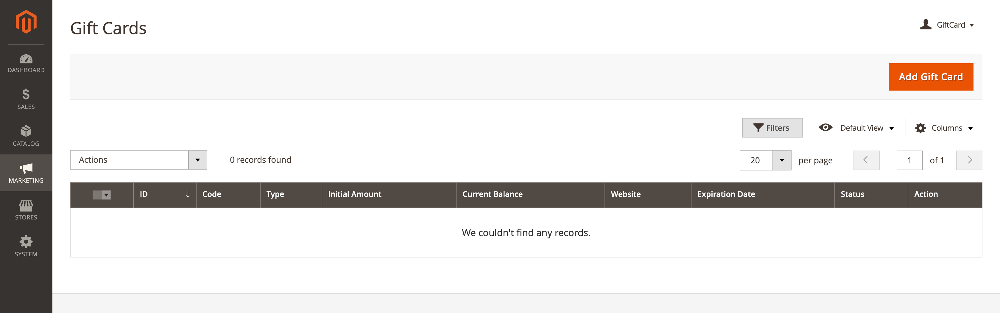{ loading=lazy }

### Create a new gift card

Click `Add Gift Card` to go to the gift card creation page.

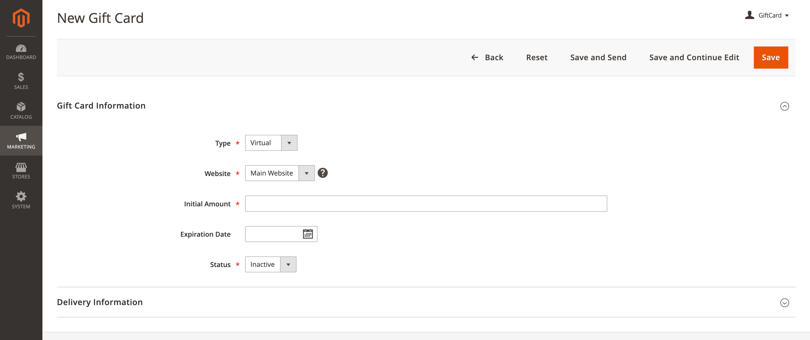{ loading=lazy }

| FIELD           | DESCRIPTION                                                                         |
|-----------------|-------------------------------------------------------------------------------------|
| Type            | Determines the gift card type. Options: Virtual / Physical                          |
| Website         | Determines the website where the gift card is available.                            |
| Initial Amount  | The initial amount on the gift card.                                                |
| Expiration Date | The expiration date of the gift card. If left blank, the gift card does not expire. |
| Status          | Determines the gift card status. Options: Inactive / Active / Used / Expired        |

For `Virtual` gift cards, an additional set of fields is available in the `Delivery Information` section.

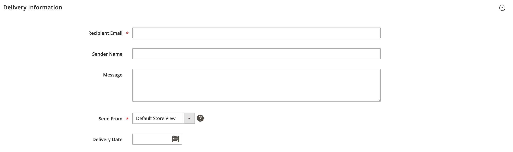{ loading=lazy }

| FIELD           | DESCRIPTION                                                                                                       |
|-----------------|-------------------------------------------------------------------------------------------------------------------|
| Recipient Email | The email address of the gift card recipient.                                                                     |
| Sender Name     | The name of the sender of the gift card.                                                                          |
| Message         | The message from the sender of the gift card that will be sent to the recipient along with the gift card details. |
| Send From       | Determines the store view that appears as the sender of the gift card notification.                               |
| Delivery Date   | The date the gift card will be emailed to the recipient. If left blank, click `Save & Send` to send.              |

## Gift card product

For each purchased product of the gift card type, a gift card is automatically created. A gift card is created after the
payment is captured and the order is invoiced. The code for the created gift card can be viewed by opening the order in the Admin.

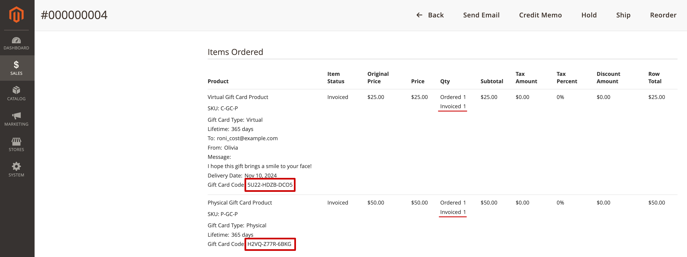{ loading=lazy }

### Create a gift card product

Catalog > Products

In the upper-right corner on the `Add Product` menu, choose `Gift Card (Ecwhim)`.

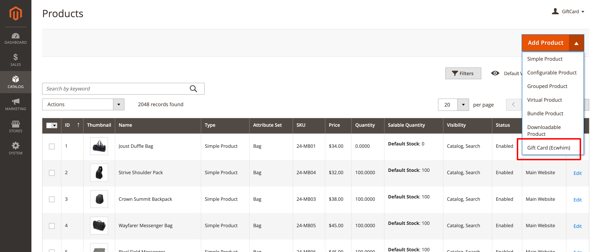{ loading=lazy }

In the product settings there is a section called `Gift Card Information`, which contains all the settings specific to
this type of product.

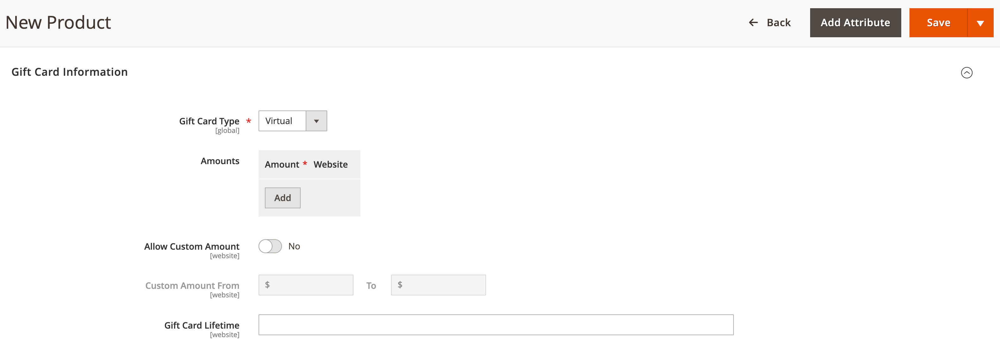{ loading=lazy }

| FIELD               | DESCRIPTION                                                                                                                                                                                                                                        |
|---------------------|----------------------------------------------------------------------------------------------------------------------------------------------------------------------------------------------------------------------------------------------------|
| Type                | Determines the gift card type. Options:   **Virtual** - Virtual gift cards are delivered to the recipient via email.   **Physical** - Physical gift cards are shipped to the recipient's address, which is required at the time of purchase. |
| Amounts             | Allows you to offer the customer a choice of fixed amounts. Click `Add` and enter the card's unique fixed amount as a decimal.                                                                                                                     |
| Allow Custom Amount | Allows you to give customers the ability to set their own gift card amount.                                                                                                                                                                        |
| Custom Amount From  | Defines the minimum allowable custom amount.                                                                                                                                                                                                       |
| (Custom Amount) To  | Defines the maximum allowable custom amount.                                                                                                                                                                                                       |
| Gift Card Lifetime  | Determines the number of days after purchase until the gift card expires. If left blank, the lifetime of the card will not be limited.                                                                                                             |

## Configuration

Stores > Configuration > ECWHIM > Gift Card

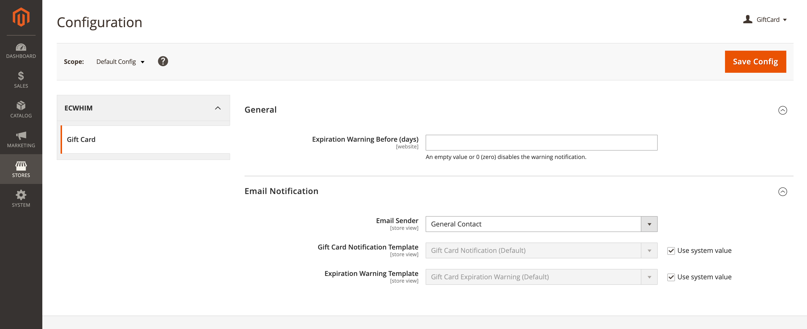{ loading=lazy }

### General

{ loading=lazy }

| FIELD                            | DESCRIPTION                                                                                                                        |
|----------------------------------|------------------------------------------------------------------------------------------------------------------------------------|
| Expiration Warning Before (days) | Specifies the number of days before a gift card expires to send the notification. Leave blank to send no expiration notifications. |

### Email Notification

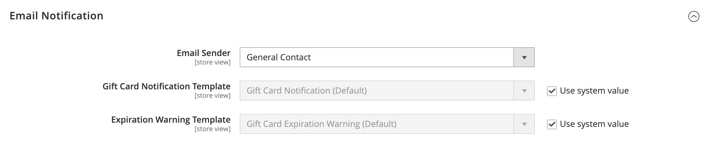{ loading=lazy }

| FIELD                           | DESCRIPTION                                                                                                                     |
|---------------------------------|---------------------------------------------------------------------------------------------------------------------------------|
| Email Sender                    | Determines the store contact that appears as the sender of email notifications related to gift cards and their expiration.      |
| Gift Card Notification Template | Determines the template that is used for the gift card notification email.                                                      |
| Expiration Warning Template     | Determines the template of the email that customers receive when the expiration warning limit has been reached for a gift card. |

## Storefront experience

### Apply a gift card

Customers can apply their gift card on the cart page and during checkout. Here, they can also check the balance and expiration date of the gift card.

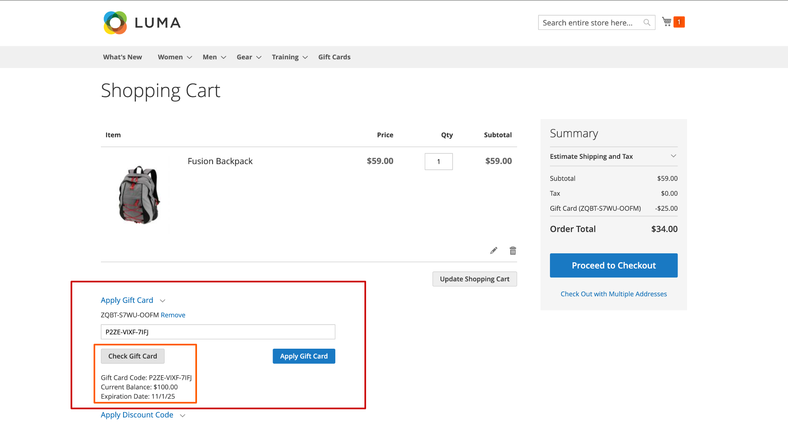{ loading=lazy }

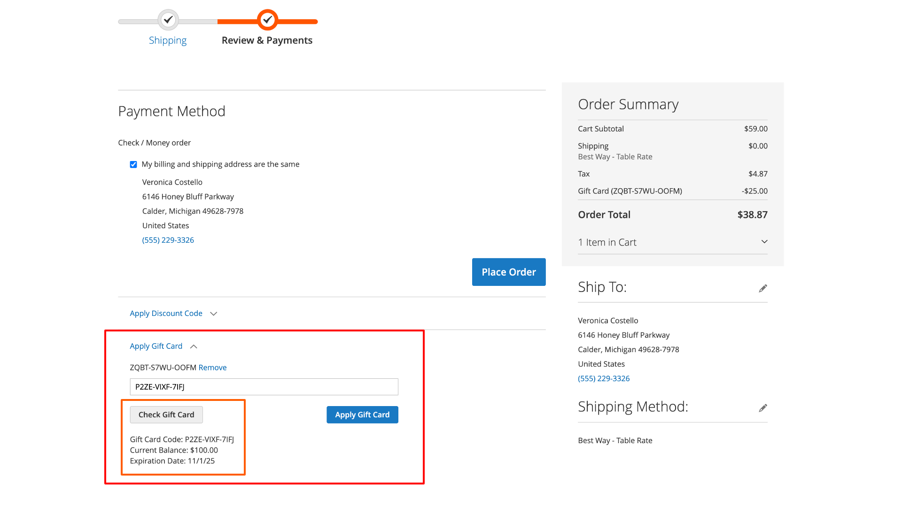{ loading=lazy }

### Gift card product

The customer determines the amount of the gift card on the product page.

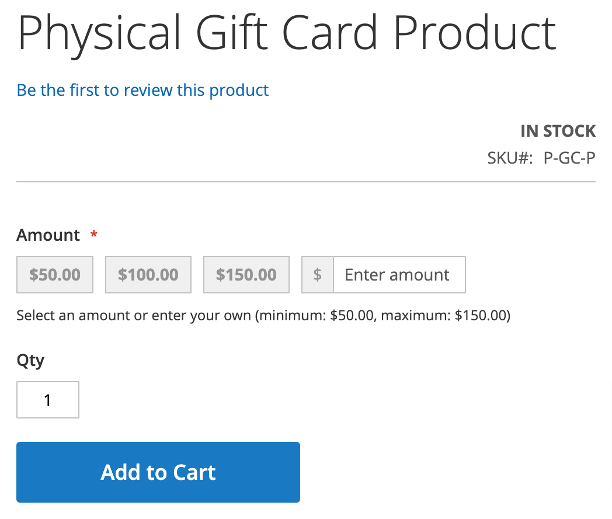{ loading=lazy }

For virtual gift cards, the customer also enters the recipient's email (**To**). They can also enter their name (**From**), enter a message to the recipient (**Message**), and set the date when the gift card should be emailed to the recipient (**Delivery Date**).

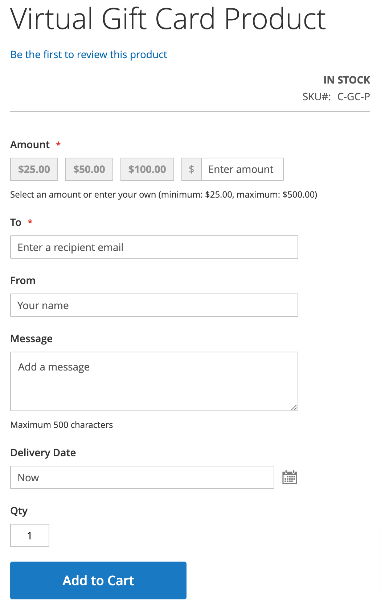{ loading=lazy }

## Create an order from the Admin

### Apply a gift card

After adding products to the cart, you can apply the gift card.

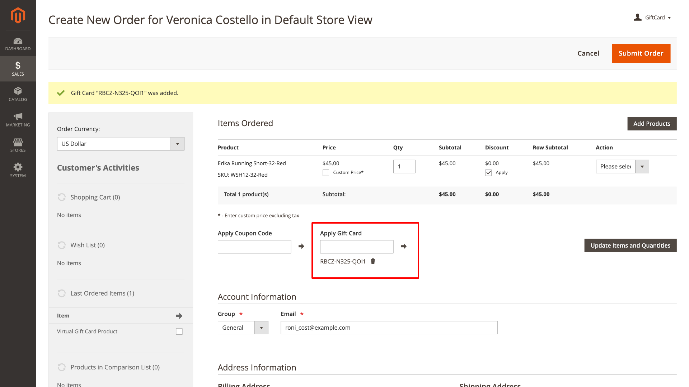{ loading=lazy }

### Add gift card products

Configure the available options for the gift card product. Below is a screenshot showing the options for the virtual gift card product.

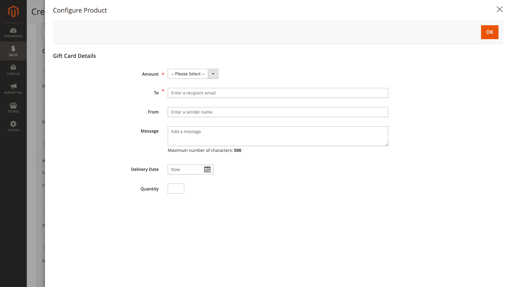{ loading=lazy }