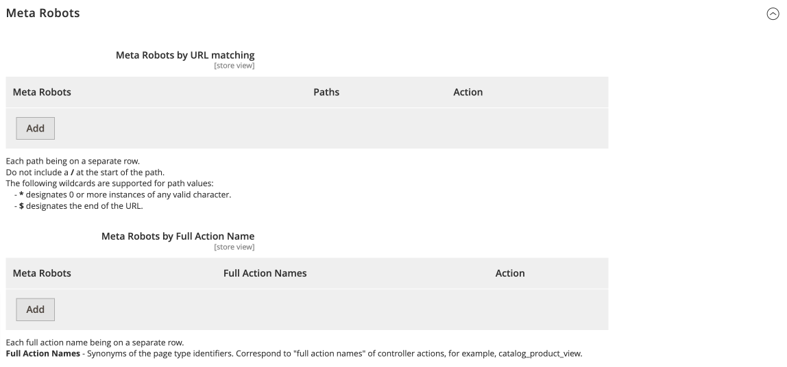
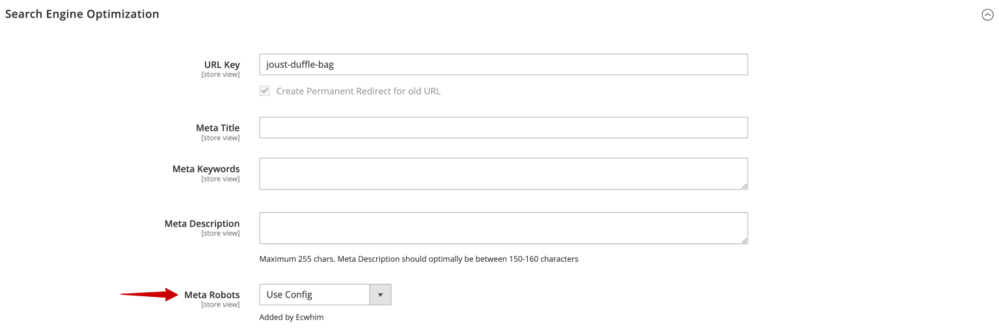
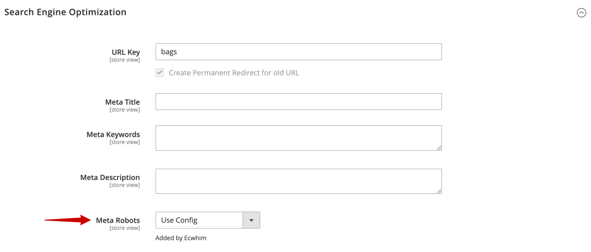
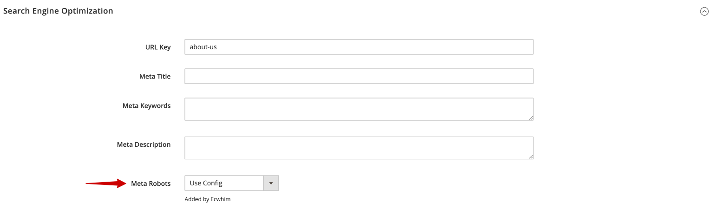

# Meta Robots

## Configuration

Stores > Configuration > ECWHIM SEO > General > Meta Robots

{ loading=lazy }

| FIELD | DESCRIPTION |
| ------| ----------- |
| Meta Robots by URL matching            | Determines the robots meta tag rules by the URL. |
| &nbsp;&nbsp;&#x2022; Meta Robots       | The combination of robots meta tag rules. Options: INDEX, FOLLOW / NOINDEX, FOLLOW / INDEX, NOFOLLOW / NOINDEX, NOFOLLOW |
| &nbsp;&nbsp;&#x2022; Paths             | The list of URL paths without store view code. The path value must not start with `/` and the value is case-sensitive. Learn more about [URL matching based on path values](#url-matching-based-on-path-values). |
| Meta Robots by Full Action Name        | Determines the robots meta tag rules by the full action name. |
| &nbsp;&nbsp;&#x2022; Meta Robots       | The combination of robots meta tag rules. Options: INDEX, FOLLOW / NOINDEX, FOLLOW / INDEX, NOFOLLOW / NOINDEX, NOFOLLOW |
| &nbsp;&nbsp;&#x2022; Full Action Names | Synonyms of the page type identifiers. Correspond to "full action names" of controller actions, for example, catalog_product_view. |

### URL matching based on path values

The following wildcards are supported for path values:

- `*` designates 0 or more instances of any valid character.
- `&` designates the end of the URL.

| Example path matches |             |
| ---------------------| ----------- |
| men                  | Matches any path that starts with **men**. Note that the matching is case-sensitive. &#9989; **Matches:** &#x2022; men &#x2022; men.html &#x2022; men/tops.html &#x2022; menu &#x2022; men.html?p=2 &#10060; **Doesn't match:** &#x2022; Men &#x2022; women.html &#x2022; ?cat=men &#x2022; shoes/men.html |
| men*                 | Equivalent to **men**. The trailing wildcard is ignored. &#9989; **Matches:** &#x2022; men &#x2022; men.html &#x2022; men/tops.html &#x2022; menu &#x2022; men.html?p=2 &#10060; **Doesn't match:** &#x2022; Men &#x2022; women.html &#x2022; ?cat=men &#x2022; shoes/men.html |
| men/                 | Matches anything in the **men/** folder. &#9989; **Matches:** &#x2022; men/ &#x2022; men/tops.html &#x2022; men/?id=anything &#10060; **Doesn't match:** &#x2022; men &#x2022; men.html &#x2022; shoes/men/ &#x2022; Men/tops.html |
| *.html               | Matches any path that contains **.html**. &#9989; **Matches:** &#x2022; men.html &#x2022; women.html &#x2022; men/tops.html &#x2022; men/tops.html?p=2 &#10060; **Doesn't match:** &#x2022; women.HTML &#x2022; about-us |
| *.html$              | Matches any path that ends with **.html**. &#9989; **Matches:** &#x2022; men.html &#x2022; men/tops.html &#10060; **Doesn't match:** &#x2022; men/tops.html?p=2 &#x2022; men.html/ &#x2022; men.html5 &#x2022; women.HTML |
| men*.html            | Matches any path that contains **men** and **.html**, in that order. &#9989; **Matches:** &#x2022; men.html &#x2022; menu/soda.html?parameters &#10060; **Doesn't match:** &#x2022; Men.HTML |

## Individual settings for entities

### Product

Open the product in edit mode and expand the _Search Engine Optimization_ section.

{ loading=lazy }

| FIELD       | DESCRIPTION |
| ----------- | ----------- |
| Meta Robots | The robots meta tag lets you utilize a page-specific approach to controlling how an individual page should be indexed and served to users in search results. Options: Use Config / INDEX, FOLLOW / NOINDEX, FOLLOW / INDEX, NOFOLLOW / NOINDEX, NOFOLLOW |

### Category

Open the category in edit mode and expand the _Search Engine Optimization_ section.

{ loading=lazy }

| FIELD       | DESCRIPTION |
| ----------- | ----------- |
| Meta Robots | The robots meta tag lets you utilize a page-specific approach to controlling how an individual page should be indexed and served to users in search results. Options: Use Config / INDEX, FOLLOW / NOINDEX, FOLLOW / INDEX, NOFOLLOW / NOINDEX, NOFOLLOW |

### CMS Page

Open the CMS page in edit mode and expand the _Search Engine Optimization_ section.

{ loading=lazy }

| FIELD       | DESCRIPTION |
| ----------- | ----------- |
| Meta Robots | The robots meta tag lets you utilize a page-specific approach to controlling how an individual page should be indexed and served to users in search results. Options: Use Config / INDEX, FOLLOW / NOINDEX, FOLLOW / INDEX, NOFOLLOW / NOINDEX, NOFOLLOW |
