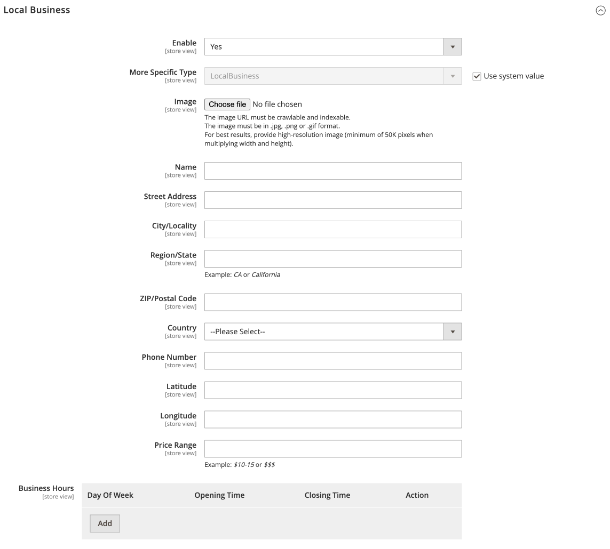
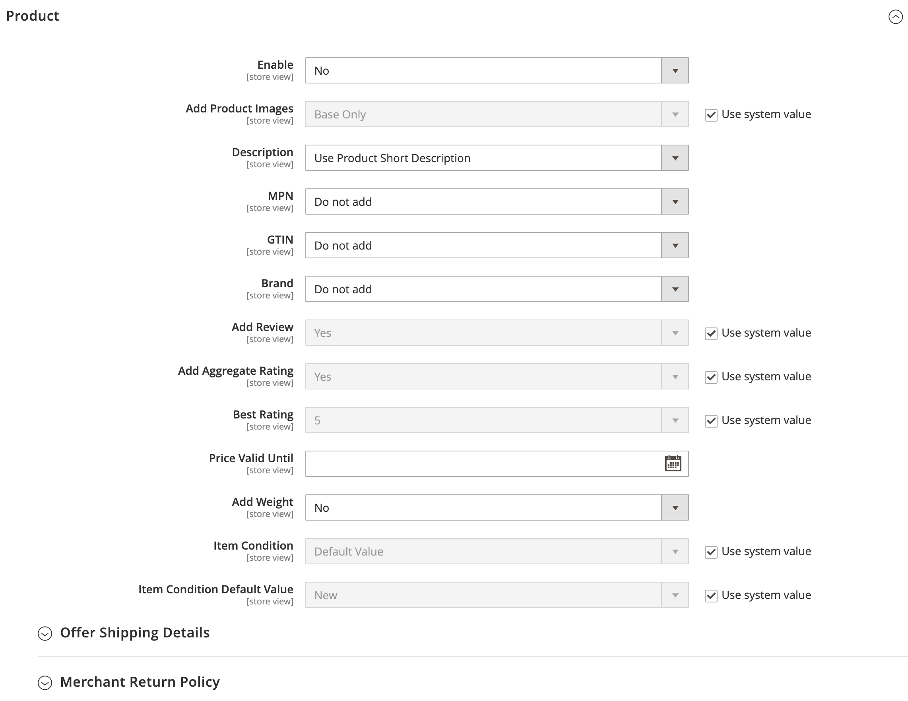
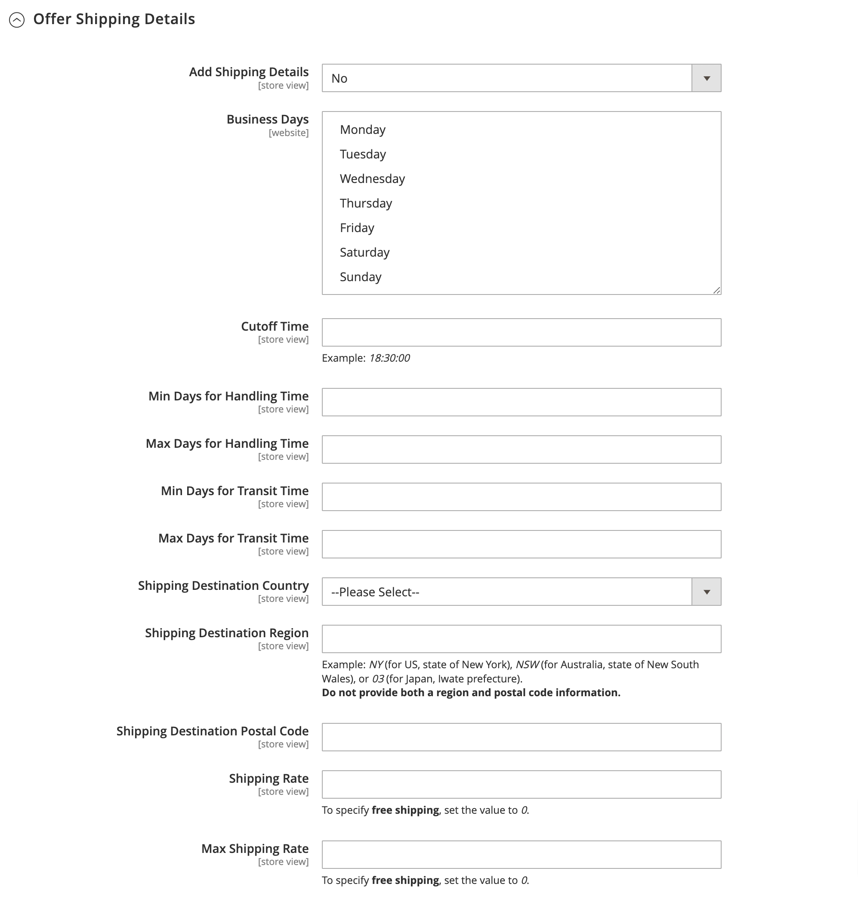
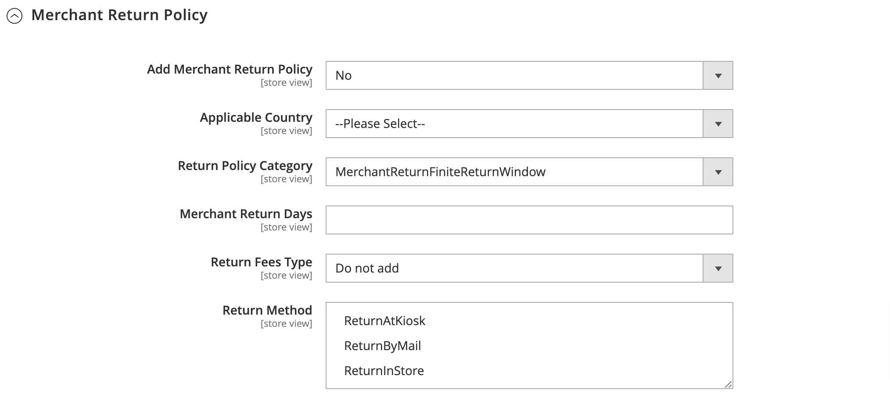

# Rich Snippets

## Configuration

Stores > Configuration > ECWHIM SEO > Rich Snippets

{ loading=lazy }

### Breadcrumb

{ loading=lazy }

| FIELD  | DESCRIPTION |
| ------ | ----------- |
| Enable | Determines whether functionality for adding breadcrumb markup to product and category pages is enabled. Options: Yes / No |

### Local Business

{ loading=lazy }

Set **Enable** to `Yes` to see more settings.

{ loading=lazy }

| FIELD  | DESCRIPTION |
| ------ | ----------- |
| Enable              | Determines whether functionality for adding local business markup to the home page is enabled. Options: Yes / No |
| More Specific Type  | Determines the most specific LocalBusiness sub-type possible. |
| Image               | An image of the business. |
| Name                | The name of the business. |
| Street Address      | The street address. |
| City/Locality       | The locality in which the street address is, and which is in the region. |
| Region/State        | The region in which the locality is, and which is in the country. For example: _California or CA_ |
| ZIP/Postal Code     | The postal code. |
| Country             | The country. |
| Phone Number        | The telephone number. A business phone number meant to be the primary contact method for customers. Be sure to include the country code and area code in the phone number. |
| Latitude            | The latitude of the business location. The precision must be at least 5 decimal places. |
| Longitude           | The longitude of the business location. The precision must be at least 5 decimal places. |
| Price Range         | The relative price range of a business, commonly specified by either a numerical range (for example, _$10-15_) or a normalized number of currency signs (for example, _$$$_). |
| Business Hours      | Determines the hours during which the business location is open. |
| &nbsp;&nbsp;&#x2022; Day Of Week  | The day(s) of the week for which these opening hours are valid. Options: Monday / Tuesday / Wednesday / Thursday / Friday / Saturday / Sunday |
| &nbsp;&nbsp;&#x2022; Opening Time | The time the business location opens, in hh:mm format. |
| &nbsp;&nbsp;&#x2022; Closing Time | The time the business location closes, in hh:mm format. |

### Logo

{ loading=lazy }

| FIELD  | DESCRIPTION |
| ------ | ----------- |
| Enable | Determines whether functionality for adding logo markup to the home page is enabled. Options: Yes / No |
| Logo   | A logo that is representative of the organization. |

### Product

{ loading=lazy }

| FIELD                        | DESCRIPTION |
| ---------------------------- | ----------- |
| Enable                       | Determines whether functionality for adding product markup to the product page is enabled. Options: Yes / No |
| Add Product Images           | Determines the extent that images are included in the markup. Options: Base Only / All |
| Description                  | Determines the attribute whose value will be used in the markup for the **`description`** property. |
| MPN                          | Determines the attribute whose value will be used in the markup for the **`mpn`** property. If set to `Do not add`, the **`mpn`** property will not be included in the markup. |
| GTIN                         | Determines the attribute whose value will be used in the markup for the **`gtin`** property. If set to `Do not add`, the **`gtin`** property will not be included in the markup. |
| Brand                        | Determines the attribute whose value will be used in the markup for the **`brand`** property. If set to `Do not add`, the **`brand`** property will not be included in the markup. |
| Add Review                   | Determines whether to include the **`review`** property in the markup. Options: Yes / No |
| Add Aggregate Rating         | Determines whether to include the **`aggregateRating`** property in the markup. Options: Yes / No |
| Best Rating                  | The highest value allowed in this rating system. Options: 5 / 10 / 100 |
| Price Valid Until            | The date after which the price is no longer available. |
| Add Weight                   | Determines whether to include the **`weight`** property in the markup. Options: Yes / No |
| Item Condition               | Defines an attribute whose value will be used to determine the value of the **`itemCondition`** property. If set to `Default Value`, the value of the **`itemCondition`** property is determined by the **Item Condition Default Value** setting. If set to `Do not add`, the **`itemCondition`** property will not be included in the markup. |
| Item Condition Default Value | Determines the default value of the **`itemCondition`** property. Options: New / Used / Damaged / Refurbished |
| Item Condition Values        | Determines the value of the **`itemCondition`** property according to the value of the attribute specified in the **Item Condition** setting. |

#### Offer Shipping Details

{ loading=lazy }

| FIELD                            | DESCRIPTION                                                                                                                                                                                                            |
|----------------------------------|------------------------------------------------------------------------------------------------------------------------------------------------------------------------------------------------------------------------|
| Add Shipping Details             | Determines whether to include the **`shippingDetails`** property in the markup. Options: Yes / No                                                                                                                      |
| Business Days                    | Days of the week when the merchant typically operates. Options: Monday / Tuesday / Wednesday / Thursday / Friday / Saturday / Sunday                                                                                   |
| Cutoff Time                      | Order cutoff time allows merchants to describe the time after which they will no longer process orders received on that day. For orders processed after cutoff time, one day gets added to the delivery time estimate. |
| Min Days for Handling Time       | The minimum number of days between the receipt of the order and the goods leaving the warehouse.                                                                                                                       |
| Max Days for Handling Time       | The maximum number of days between the receipt of the order and the goods leaving the warehouse.                                                                                                                       |
| Min Days for Transit Time        | The minimum number of days between when the order has been sent for delivery and when the goods reach the final customer.                                                                                              |
| Max Days for Transit Time        | The maximum number of days between when the order has been sent for delivery and when the goods reach the final customer.                                                                                              |
| Shipping Destination Country     | The country.                                                                                                                                                                                                           |
| Shipping Destination Region	    | Identifies the region for the customer delivery area.   **Do not provide both a region and postal code information**.                                                                                               |
| Shipping Destination Postal Code | The postal code.                                                                                                                                                                                                       |
| Shipping Rate	                | The cost of shipping to the specified destination.   To specify **free shipping**, set the value to `0`.                                                                                                                                                                     |
| Max Shipping Rate                | The maximum cost of shipping to the specified destination.   To specify **free shipping**, set the value to `0`.                                                                                                    |

#### Merchant Return Policy

{ loading=lazy }

| FIELD                        | DESCRIPTION                                                                                                                                                                                                                                  |
|------------------------------|----------------------------------------------------------------------------------------------------------------------------------------------------------------------------------------------------------------------------------------------|
| Add Merchant Return Policy   | Determines whether to include the **`hasMerchantReturnPolicy`** property in the markup. Options: Yes / No                                                                                                                                    |
| Applicable Country           | The country that the return policy applies to.                                                                                                                                                                                               |
| Return Policy Category       | The type of return policy. Options: MerchantReturnFiniteReturnWindow / MerchantReturnNotPermitted / MerchantReturnUnlimitedWindow.   If set to `MerchantReturnFiniteReturnWindow`, then the **Merchant Return Days** setting is required. |
| Merchant Return Days         | Specifies the number of days (from the delivery date) that a product can be returned.                                                                                                                                                        |
| Return Fees Type             | Specifies the type of return fees. Options: Do not add / FreeReturn / ReturnFeesCustomerResponsibility / ReturnShippingFees.   If set to `Do not add`, the **`returnFees`** property will not be included in the markup.                  |
| Return Method                | The type of return method offered. Use one or more of the following options: ReturnAtKiosk / ReturnByMail / ReturnInStore                                                                                                                    |
| Return Shipping Fees Amount  | The cost of shipping for returning a product. This setting is available when **Return Fees Type** is set to `ReturnShippingFees`.                                                                                                            |

### Sitelinks Search Box

{ loading=lazy }

| FIELD  | DESCRIPTION |
| ------ | ----------- |
| Enable | Determines whether functionality for adding sitelinks search box markup to the home page is enabled. Options: Yes / No |

### Open Graph protocol

{ loading=lazy }

Set **Enable** to `Yes` to see more settings.

{ loading=lazy }

| FIELD  | DESCRIPTION |
| ------ | ----------- |
| Enable          | Determines whether functionality for adding Open Graph protocol markup to a web page is enabled. Options: Yes / No |
| Facebook App Id | Enter the Facebook App Id to use Facebook Insights. Insights lets you view analytics for traffic to your site from Facebook. |
| Enable on       | Determines the types of pages for which the functionality for adding Open Graph protocol markup is enabled. Options: Product Page / Category Page / CMS Page / Home Page |

### Twitter Cards

{ loading=lazy }

Set **Enable** to `Yes` to see more settings.

{ loading=lazy }

| FIELD  | DESCRIPTION |
| ------ | ----------- |
| Enable           | Determines whether functionality for adding Twitter Card markup to a web page is enabled. Options: Yes / No |
| Twitter Username | The Twitter @username the card should be attributed to. |
| Enable on        | Determines the types of pages for which the functionality for adding Twitter Card markup is enabled. Options: Product Page / Category Page / CMS Page / Home Page |
