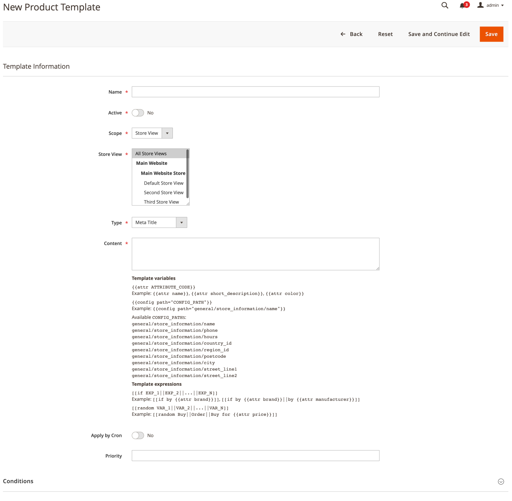
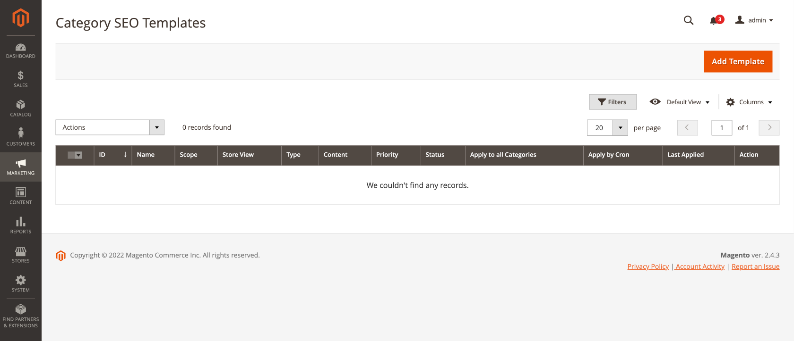
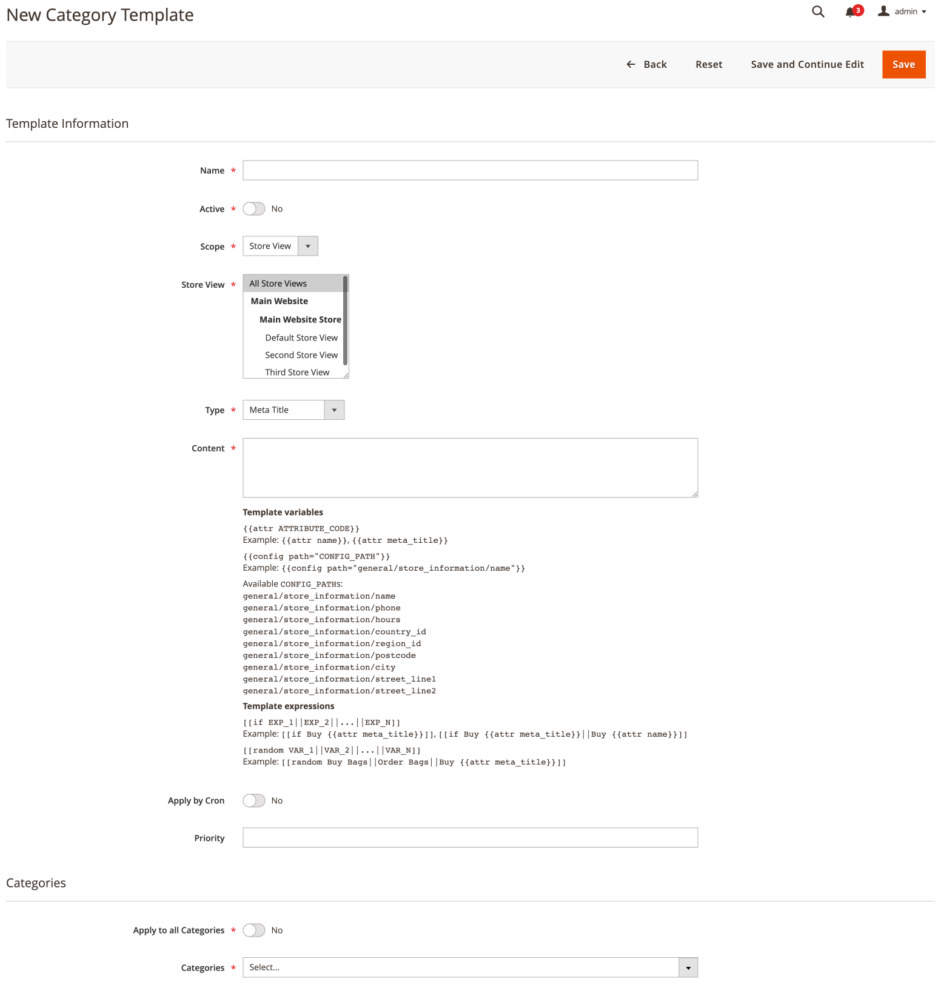

# SEO Templates

## Manage Product Templates

Marketing > SEO Templates > Product Templates

{ loading=lazy }

### Create a new Product Template
Click `Add Template` to go to the template creation page.

{ loading=lazy }

| FIELD                           | DESCRIPTION |
| ------------------------------- | ----------- |
| Name          | The name of the template is for internal reference. |
| Active        | Determines if the template is currently active. Options: Yes / No |
| Scope         | Determines the scope within which the template will be applied. Options: Store View / Global |
| Store View    | Determines the store views where the template will be applied. |
| Type          | Determines the template type. The template type corresponds to the product attribute for which the template generates values. Options: Meta Title / Meta Keywords / Meta Description |
| Content       | The content of the template. The content consists of a combination of text, variables, and expressions. |
| Apply by Cron | Determines whether to apply the template automatically on a schedule using cron. Options: Yes / No |
| Priority      | A number that indicates the priority of this template in relation to others of the same type. The highest priority is number 0. |

In the `Conditions` tab, specify the conditions that must be met to determine the products to which the template applies. If left blank, the template applies to all products.

{ loading=lazy }

## Manage Category Templates

Marketing > SEO Templates > Category Templates

{ loading=lazy }

### Create a new Category Template
Click `Add Template` to go to the template creation page.

{ loading=lazy }

| FIELD                           | DESCRIPTION |
| ------------------------------- | ----------- |
| Name          | The name of the template is for internal reference. |
| Active        | Determines if the template is currently active. Options: Yes / No |
| Scope         | Determines the scope within which the template will be applied. Options: Store View / Global |
| Store View    | Determines the store views where the template will be applied. |
| Type          | Determines the template type. The template type corresponds to the category attribute for which the template generates values. Options: Meta Title / Meta Keywords / Meta Description |
| Content       | The content of the template. The content consists of a combination of text, variables, and expressions. |
| Apply by Cron | Determines whether to apply the template automatically on a schedule using cron. Options: Yes / No |
| Priority      | A number that indicates the priority of this template in relation to others of the same type. The highest priority is number 0. |
| Apply to all Categories | Determines whether to apply the template to all categories. Options: Yes / No |
| Categories              | Determines the categories for which the template applies. |

## CLI commands

1. Log in to your Magento server as, or switch to, the file system owner.
2. Navigate to your Magento project directory.

### View a list of templates
To view a list of all Product Templates:
```shell
php bin/magento ecwhim-seo:seotemplates:product-template:list
```
To view a list of all Category Templates:
```shell
php bin/magento ecwhim-seo:seotemplates:category-template:list
```

### Apply template(s)
Use this command to apply all or selected templates.

Command options for Product Templates:
```shell
php bin/magento ecwhim-seo:seotemplates:product-template:apply [template_id]
```
Command options for Category Templates:
```shell
php bin/magento ecwhim-seo:seotemplates:category-template:apply [template_id]
```
Where `[template_id]` is a space-separated list of template ids. Omit `[template_id]` to generate all templates.

### Delete template(s)
Use this command to delete all or selected templates.

Command options for Product Templates:
```shell
php bin/magento ecwhim-seo:seotemplates:product-template:delete [template_id]
```
Command options for Category Templates:
```shell
php bin/magento ecwhim-seo:seotemplates:category-template:delete [template_id]
```
Where `[template_id]` is a space-separated list of template ids. Omit `[template_id]` to delete all templates.
